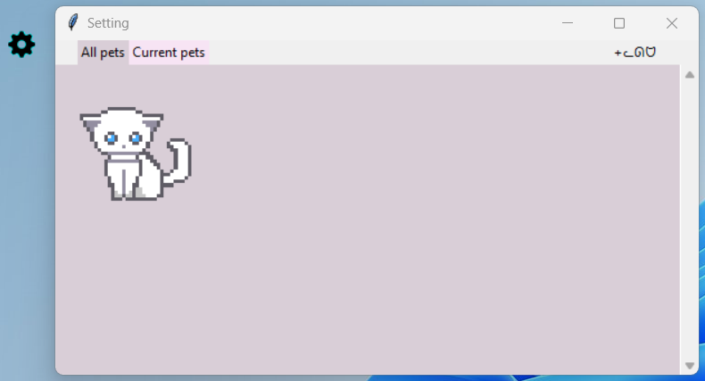
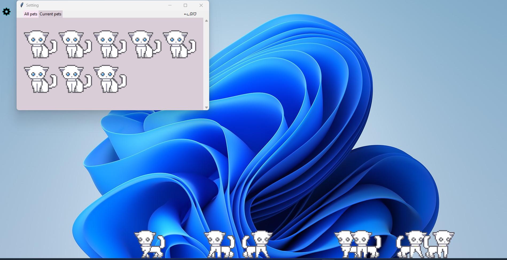
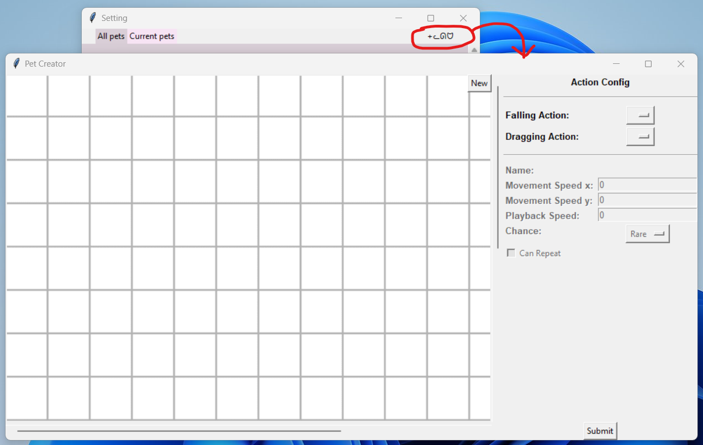
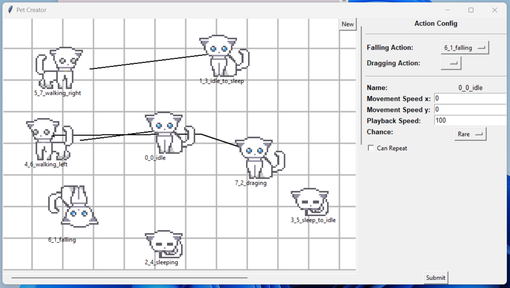

# A simple Windows Desktop Pet Creator using python and tkinter ᓚᘏᗢ

Current pet assets are borrowed from [this tutorial](https://medium.com/@thenobodydev).

IMPORTANT: check out [WIP list](#wip)

## Vision:
The main component of the application is a transparent overlay that sits on top of the desktop to draw animated pets on the taskbar. Pets will randomly go idle, move around, or more based on a predefined actions sequence. The other major feature is the Pet Creator, a tool that lets users create new pets and customize their actions sequence.

Pets will move around horizontally on the taskbar and can be dragged with the cursor around the screen. Dragged pet on release will slowly falls down until it hits the taskbar and resumes its actions sequence loop.

The pet's horizontal speed, vertical speed, dragging and falling animations can be customized using the Pet Creator tool along with other settings.

### Running the app
ATM, the application is run as a normal python script. Recommended using python 3+ to run. A few pieces are pulled from Windows API so currently it only runs on Windows. 

### Walkthrough

Features are accessible from the gear icon on the top left of the screen.

In the Setting window, users can:
- Create a new pet by selecting a pet blueprint from the __All pets__ tab, in this case is a white cat.
- Manage (mostly just delete for now) pets from the __Current pets__ tab.
- Open the Pet Creator window.

In the Pet Creator window, users can:
- Add pet actions using gif files from local folders using __New__.
- Utilize a drawing canvas to specify the relationship between each action by creating and dragging lines between actions, specify how likely an action will occurs, and can an action loop back to itself a couple of times. For example, an idle action can leads to either a sleeping action or walking action, but shouldn't leads a falling action (or it should, thats for the users to decide). The idle action can also leads back to itself using the __Can Repeat__ checkbox.
- (WIP) the playback value controls the playback speed of the gif file for an action in ms.

## WIP:
- Redo the UI to a modern look.
- Create and add new pet blueprints.
- Detach the script and turn it into a windows process.
- Instead of the gear icon, setup the entry point for the app through the system app tray.
- IMPORTANT: when adding new actions in the __Pet Creator__ window, gif files should only be 100x100 pixel. Add feat to force resize the gifs after importing them.

